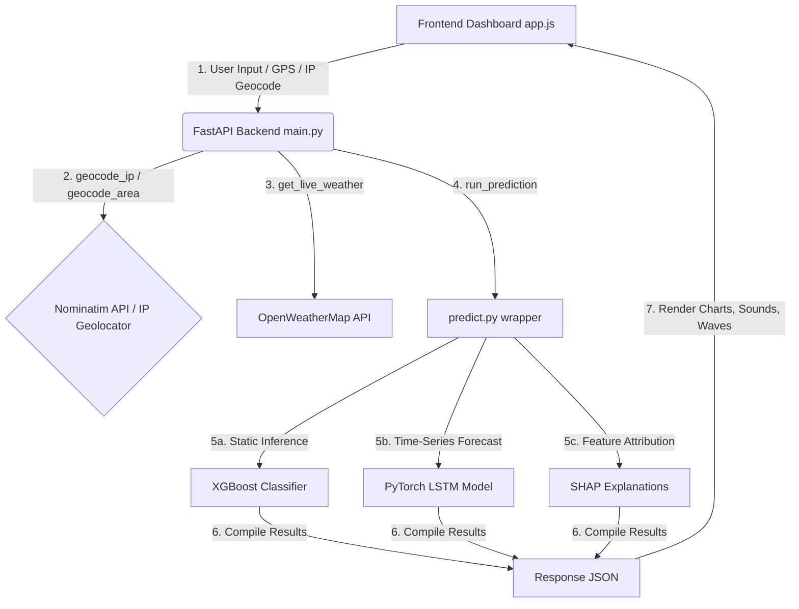

# Chennai Flood Predictor (XGBoost & LSTM Hydrological Ensemble)


An immersive, high-tech early warning system and predictive dashboard for monitoring and forecasting flood risks across the Chennai Metropolitan hydrological zone. 

The application uses a hybrid machine learning approach: an **XGBoost Classifier** for immediate risk categorization based on geological features, and a **PyTorch LSTM Neural Network** for sequential time-series rainfall forecasting. It is fully hardened with modern web security practices, features an interactive Leaflet mapping interface, runs a dynamic Web Audio synthesis engine for atmospheric feedback, and supports a resilient client-side offline evaluation fallback.

---

## 🚀 Key Features

* **Dual Machine Learning Ensemble**:
  * **XGBoost Classifier**: Predicts localized flood probability class (Low, Moderate, High, Severe) using spatial factors like elevation, drainage capacity, distance to river, soil moisture, and current rain rate.
  * **PyTorch LSTM Network**: Synthesizes historical monsoonal patterns and models a 72-hour hourly rainfall accumulation vector to forecast the next 48 hours.
* **Explainable AI (XAI)**: Integrated **SHAP (SHapley Additive exPlanations)** explanations dynamically computed on the backend to tell the user *exactly* why a specific area was flagged for flood risk.
* **Immersive Visuals & Real-Time Telemetry**:
  * Glassmorphism dark-themed dashboard with responsive CSS grid styling.
  * Dynamic wave animations at the bottom that change height and color to match the average calculated city risk index.
  * Live-simulated telemetry feed from key hydrological sensors (Adyar River, Cooum River, Buckingham Canal).
* **High-Tech Web Audio Synthesis**:
  * Real-time synthesis of storm sounds (rain patter, wind nodes, lightning cracks) using the native browser **Web Audio API** (with pre-recorded track fallbacks).
  * Submarine sonar echoing radar pings synced with the map's visual radar sweep.
  * Distinct warning chimes and sirens tailored to the predicted risk level (Severe, High, Moderate, Low).
* **Resilient Geolocation**:
  * Desktop-tuned native browser GPS querying.
  * **IP Geolocation Fallback**: Automatically geolocates the user via their public IP address on the backend if GPS permission is denied or blocked.
* **Comprehensive Security Hardening**:
  * **CORS Protection**: Hardened CORS headers (disabled credential sharing on wildcard origins) to block cross-origin credentials hijacking.
  * **IP Rate Limiting**: Customized backend middleware limiting request bursts to 30 requests/minute on critical endpoints.
  * **HTTP Security Headers**: Native middleware injecting CSP (Content Security Policy), X-Frame-Options, X-Content-Type-Options, and Referrer policies.
  * **DOM XSS Injection Defenses**: Input escaping and sanitization on all dynamic frontend elements rendering variables.
  * **SSRF Prevention**: URL-encoding Nominatim search queries.

---

## 📐 System Architecture



---

## 📂 Project Structure

```
├── backend/
│   ├── data/
│   │   └── generate_training_data.py   # Training dataset synthesizer
│   ├── model/
│   │   ├── predict.py                  # Ensemble inference wrapper
│   │   ├── train_lstm.py               # PyTorch LSTM trainer
│   │   ├── train_xgboost.py            # XGBoost trainer
│   │   └── shap_explain.py             # SHAP explanations generator
│   ├── saved_models/
│   │   ├── lstm_rainfall_model.h5      # Trained LSTM weights
│   │   └── xgboost_flood_model.pkl     # Trained XGBoost binary
│   └── main.py                         # FastAPI backend controller
├── frontend/
│   ├── static/                         # High-fidelity audio tracks (.mp3)
│   ├── app.js                          # Frontend controller & Web Audio
│   ├── index.html                      # Main dashboard layout
│   └── style.css                       # Premium glassmorphism stylesheets
├── .env                                # Local configuration keys (ignored by git)
├── .gitignore                          # Git exclusions file
├── Dockerfile                          # Deployment Dockerfile
├── Procfile                            # Cloud deployment configuration
└── README.md                           # Documentation
```

---

## 🛠️ Installation & Setup

### 1. Prerequisites
* **Python 3.11 or 3.12 / 3.13**
* **Git**

### 2. Clone and Setup Environment
```bash
# Clone the repository
git clone <your-github-repo-url>
cd chennai-flood-predictor

# Create virtual environment
python3 -m venv .venv
source .venv/bin/activate  # On Windows: .venv\Scripts\activate

# Install dependencies
pip install -r backend/requirements.txt
# (Optional: install torch manually if not present in your requirements)
pip install torch
```

### 3. Configure API Keys
Create a `.env` file at the root of the project:
```ini
OPENWEATHER_API_KEY=your_openweathermap_api_key_here
```

---

## 🏃 Running the Application

### 1. Start the FastAPI Backend
```bash
# Run from root folder
env PYTHONPATH=. .venv/bin/python backend/main.py
```
The server will start at `http://localhost:8000`.

### 2. Access the Dashboard
Open your browser and navigate to:
* **http://localhost:8000** (Full API mode, live radar, and maps)
* Alternatively, open **`frontend/index.html`** directly using `file://` (triggers the resilient local fallback simulation engine).

---

## 🛡️ Security Verification

To test the security hardening built into this repository:
1. **Response Headers**:
   ```bash
   curl -I http://localhost:8000/health
   # Look for x-frame-options: DENY and content-security-policy headers
   ```
2. **Rate Limiting**:
   ```bash
   # Send a burst of requests to test rate limiting
   for i in {1..35}; do curl -s -o /dev/null -w "%{http_code}\n" "http://localhost:8000/geocode?area_name=Velachery"; done
   # First 30 return 200, remainder will return 429 Too Many Requests
   ```
3. **DOM XSS Check**:
   Input a malicious payload like `` in the SMS Alert subscription field and press **Subscribe Alerts**. The input is safely escaped to text and renders without script execution.

---

## 📝 License
This project is licensed under the Apache-2.0 License.
